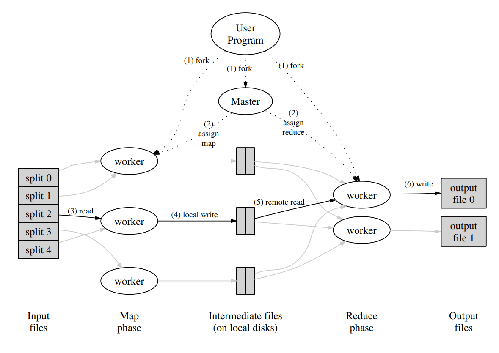

[[TOC]]

# MapReduce: 大型集群上的简化数据处理

著作信息:

- Jeffrey Dean and Sanjay Ghemawat
- jeff@google.com, sanjay@google.com
- Google, Inc.

# 摘要

MapReduce是一种编程模型和相关的实现，用于处理和生成大型数据集。用户指定一个Map函数，该函数处理一个键/值对以生成一组中间键/值对，以及一个归约函数，该函数合并与同一中间键相关联的所有中间值。许多现实世界的任务都可以在这个模型中表达出来，如本文所示。

以这种功能风格编写的程序被自动并行化，并在一大群并行机器上执行。运行时系统负责对输入数据进行分区、在一组机器上调度程序的执行、处理机器故障以及管理所需的机器间通信等细节。这使得没有任何并行和分布式系统经验的程序员可以轻松地利用大型分布式系统的资源。

我们的MapReduce实现运行在大型商用机器集群上，并且具有高度可伸缩性:典型的MapReduce计算在数千台机器上处理大量数据。程序员发现这个系统很容易使用:数百个MapReduce程序已经实现，每天有超过1000个MapReduce作业在谷歌的集群上执行。

# 1. 简介

在过去的五年里，作者和Google的许多其他人已经实现了数百个特殊用途的计算，处理大量的原始数据，如抓取的文档，Web请求日志等。计算各种导出数据，例如倒排索引、Web文档的图形结构的各种表示、每个主机爬行的页面数量的汇总、给定一天中最频繁查询的集合等。大多数这样的计算在概念上是简单明了的。然而，输入数据通常很大，计算必须分布在数百或数千台机器上，以便在合理的时间内完成。如何并行计算、分配数据和处理故障的问题，使得处理这些问题的大量复杂代码模糊了原始的简单计算。

作为对这种复杂性的反应，我们设计了一种新的抽象，允许我们表达我们试图执行的简单计算，但隐藏了库中并行化、容错、数据分布和负载平衡的混乱细节。我们的抽象受Lisp和许多其他函数式语言中的map和reduce原语的启发。我们意识到，我们的大部分计算涉及对输入中的每个逻辑“记录”应用Map操作，以便计算一组中间键/值对，然后对共享同一键的所有值应用归约操作，以便适当地组合导出的数据。我们使用具有用户指定的map和reduce操作的功能模型，这使我们能够轻松地并行化大型计算，并使用重新执行作为容错的主要机制。

这项工作的主要贡献是一个简单而强大的接口，支持大规模计算的自动并行化和分布，并结合该接口的实现，在大型商用PC集群上实现高性能。

第2节描述了基本的编程模型，并给出了几个例子。第3节描述了MapReduce接口的实现，该接口是为我们基于集群的计算环境定制的。第4节描述了我们发现有用的编程模型的几个改进。第5节对我们的各种任务的实现进行了性能测量。第6节探讨了MapReduce在Google中的使用，包括我们使用它作为重写生产索引系统的基础的经验。第7节讨论了相关的和未来的工作。

# 2. 编程模型

该计算采用一组输入键/值对，并产生一组输出键/值对。MapReduce库的用户将计算表示为两个函数：Map和Reduce。

由用户编写的Map接受一个输入对，并产生一组中间键/值对。MapReduce库将与同一中间密钥I相关联的所有中间值组合在一起，并将它们传递给归约函数。

Reduce函数也是由用户编写的，它接受一个中间键I和该键的一组值。它将这些值合并在一起，形成一个可能更小的值集。通常每次Reduce调用只产生零个或一个输出值。中间值通过迭代程序提供给用户的归约函数。这使我们能够处理太大而不适合内存的值列表。

## 2.1 例子

考虑在大量文档中计算每个单词出现的次数的问题。用户将编写类似于以下伪代码的代码:

```
map(String key, String value):
	// key: document name
	// value: document contents
	for each word w in value:
		EmitIntetabrmediate(w, "1");

reduce(String key, Iterator values):
	// key: a word
	// values: a list of counts
	int result = 0;
	for each v in values:
		result += ParseInt(v);
	Emit(AsString(result));
```

``map`` 函数输出每个单词上加一个关联的次数（在这个例子中只有1），Reduce函数输出对于特定单词所有计数相加的和。

此外，用户编写代码，用输入和输出文件的名称以及可选的调优参数来填充MapReduce对象，然后，用户调用MapReduce函数，将规范化对象传入。用户代码与MapReduce库（使用C++实现）链接到一起。附录A包含了这个例子的完整代码。

## 2.2 类型

尽管前面的伪代码是根据字符串输入和输出编写的，但从概念上讲，用户提供的map和reduce函数具有关联的类型:

```
map(k1, v1) --> list(k2, v2)
reduce(k2, list(v2)) --> list(v2)
```

即，输入键和值是从与输出键和值不同的域中提取的。此外，中间键和值与输出键和值来自同一个域。

我们的C++实现在用户定义的函数之间来回传递字符串，并让用户代码在字符串和适当类型之间进行转换。

## 2.3 更多例子

这里有几个简单的有趣程序的例子，可以很容易地表达为MapReduce计算。

- 分布式过滤：如果与提供的模式匹配，map函数会发出一条线。reduce函数是一个恒等函数，它只是将提供的中间数据复制到输出中。
- 计算URL的访问频率：map函数处理网页请求的日志并输出<URL,1>。reduce函数将同一URL的所有值加在一起，并输出一个<URL,total,count>对。
- 反向网络链接图：map函数对于指向在名为source的页面中找到每个目标URL的链接, 输出<target,source>对。reduce函数连接与给定目标URL相关联的所有源URL的列表，并发出一对: <target,list(source)>。
- 每台主机的检索词向量：术语向量将在一个文档或一组文档中出现的最重要的单词概括为<word,frequency>对的列表。map函数为每个输入文档发出一个<hostname,term,vector>对(其中主机名是从文档的URL中提取的)。reduce函数被传递给给定主机的所有每个文档的术语向量。它将这些术语向量相加，丢弃不常用的术语，然后输出最终的 <hostname,term,vector>对。
- 倒排索引：map函数解析每个文档，并且输出一个<word,document id>对序列。reduce函数接受给定单词全部的对。所有输出对的集合形成了一个简单的倒排索引。很容易增加这种计算来跟踪单词的位置。
- 分布式排序：map函数从每个记录中提取键，并输出一个<key,record>对。reduce函数不变地输出所有对。该计算取决于4.1节中描述的分区工具和4.2节中描述的排序属性。

# 3. 实现

MapReduce接口可能存在许多不同的实现。正确的选择依赖于环境。例如：一个正确的实现可能处于小型共享内存设备，另一个是大型的NUMA多处理上，并且另一个是更大的网络机器集合。

这一章描述并实现一个目的用于Google的广泛的计算环境：通过交换式以太网连接在一起的大型商用PC集群。在我们的环境中：

1. 机器是典型的运行Linux的多核心x86处理器，每个机器带有2-4GB的内存。
2. 使用商用网络硬件：在机器层面使用典型的以太网100Mbps或1Gbps，但是在整个二等分带宽上的平均要小得多。
3. 一个集群由成百上千的机器组成，因此机器故障是常见的
4. 存储由直接连接到单个机器的廉价IDE磁盘提供。内部开发的分布式文件系统用于管理存储在这些磁盘上的数据。文件系统使用复制在不可靠的硬件上提供可用性和可靠性。
5. 用户向调度系统提交作业。每个作业由一组任务组成，由调度程序映射到集群中的一组可用机器。

## 3.1 执行概述



通过将输入数据自动划分为一组M个部分，Map调用分布在多台机器上。输入拆分可以由不同的机器并行处理。通过使用分区函数(例如，hash(key) mod R)将中间密钥空间划分成R个部分，来分布Reduce调用。分区数量(R)和分区函数由用户指定。图1显示了我们实现中MapReduce操作的整体流程。当用户程序调用MapReduce函数时，会发生以下一系列操作(图1中的编号标签对应于下面列表中的编号)：

1. 用户程序中的MapReduce库首先将输入文件分成M段，每段通常为16MB到64MB(可由用户通过可选参数控制)。然后，它在一组机器上启动程序的许多副本。
2. 程序的一个副本是特殊的——Master。其余的是由Master分配工作的Worker。有M个Map任务和R个Reduce任务要分配。Master挑选空闲的Worker，给每个Worker分配一个Map任务或一个Reduce任务。
3. 被分配了Map任务的Worker读取相应输入分割的内容。它从输入数据中解析出键/值对，并将每一对传递给用户定义的Map函数。由Map函数产生的中间键/值对被缓冲在内存中。
4. 周期性地，缓冲对被写入本地磁盘，由Reduce函数划分成R个区域。这些缓冲对在本地磁盘上的位置被传递回Master，Master负责将这些位置转发给Reduce Worker。
5. 当Master通知Reduce Worker这些位置时，它使用远程过程调用从Map Workers的本地磁盘读取缓冲数据。当Reduce Worker读取了所有的中间数据后，它会按照中间键对数据进行排序，以便将所有出现的相同键组合在一起。需要进行排序，因为通常许多不同的键映射到同一个Reduce任务。如果中间数据量太大，不适合内存，就使用外部排序。
6. Reduce Worker遍历排序后的中间数据，对于遇到的每个唯一的中间键，它会将该键和相应的一组中间值传递给用户的Reduce函数。Reduce函数的输出被附加到这个Reduce分区的最终输出文件中。
7. 当所有的Map任务和Reduce任务完成后，Master唤醒用户程序。此时，用户程序中的MapReduce调用返回到用户代码。

成功完成后，MapReduce执行的输出在R输出文件中可用(每个Reduce任务一个，文件名由用户指定)。通常，用户不需要将这些R输出文件合并到一个文件中——他们通常将这些文件作为输入传递给另一个MapReduce调用，或者从另一个能够处理被划分为多个文件的输入的分布式应用程序中使用它们。

## 3.2 Master的数据结构

Master保持几种数据结构。对于每个Map任务和Reduce任务，保存状态（空闲，处理中，完成）并且标识Worker的身份信息（非空闲任务）。

Master是中间文件区域的位置从Map任务传播到Reduce任务的通道。因此，对于每个完成的Map任务，Master由Map任务产生的R个中间文件区域的位置和大小。当Map任务完成时，接收到对该位置和大小信息的更新。这些信息会以增量方式推送给正在执行Reduce任务的Worker。

## 3.3 容错

因为MapReduce库被设计成使用成百上千的机器来帮助处理非常大量的数据，所以该库必须适度地容忍机器故障。

### Worker故障

## 3.4 位置

## 3.5 任务粒度

## 3.6 备份任务

# 4. 改进

## 4.1 分区函数

## 4.2 顺序保证

## 4.3 合并函数

## 4.4 输入和输出类型

## 4.5 副作用

## 4.6 跳过坏记录

## 4.7 本地执行

## 4.8 状态信息

## 4.9 计数器

# 5. 性能

## 5.1 集群配置

## 5.2 过滤

## 5.3 排序

## 5.4 备份任务的影响

## 5.5 机器故障

# 6. 经验

## 6.1 大规模索引

# 7. 相关任务

# 8. 结论

# 9. 参考
